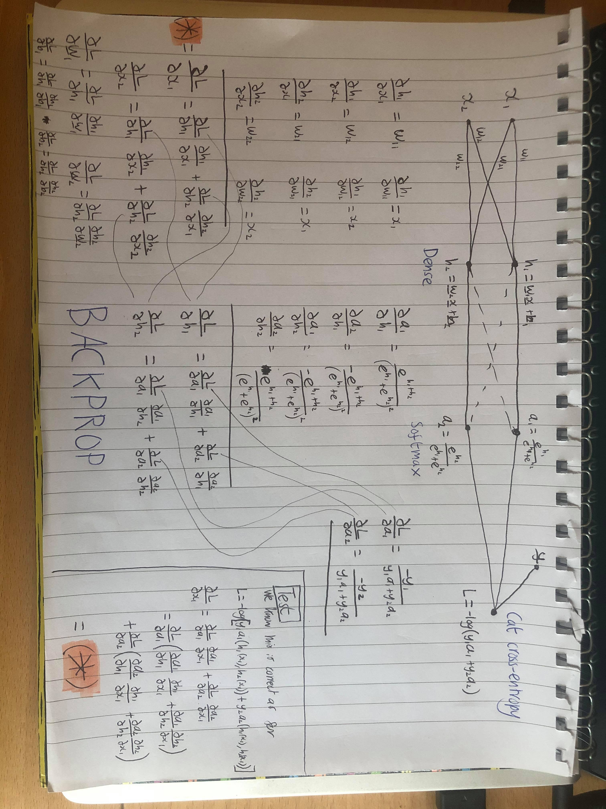

# Deep Learning Framework from Scratch

Build a deep learning framework with some challenging constraints.

## The Rules

1. No third-party libraries.
2. I cannot look at any implementation related to machine learning.
3. I cannot look into any detailed theory that would help me implement a feature.

For example, I can Google to see what the update rule for Adam is, however, I cannot Google to see how backpropagation works. Instead, learning about backpropagation looks more like the image below.

