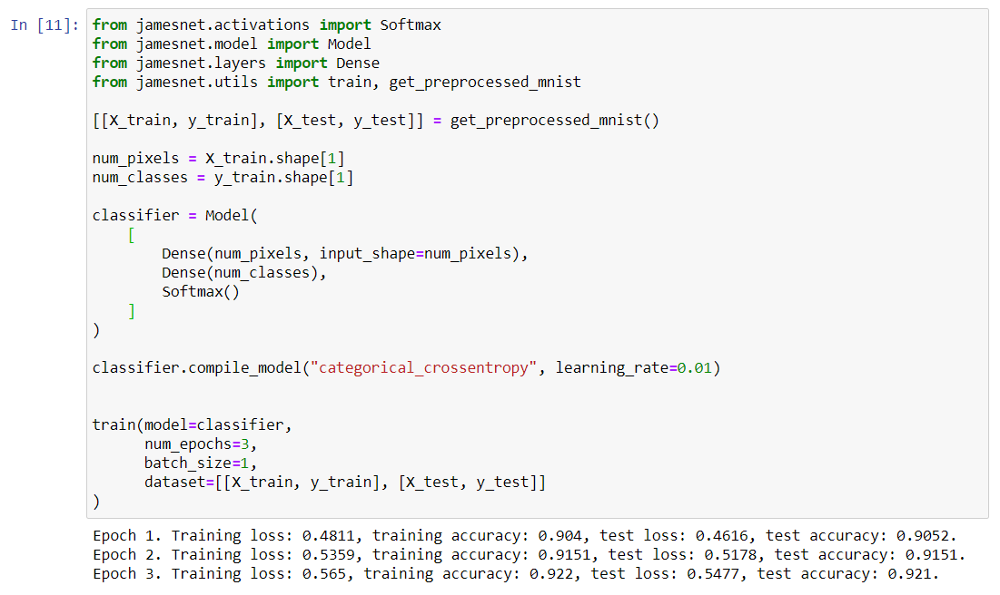
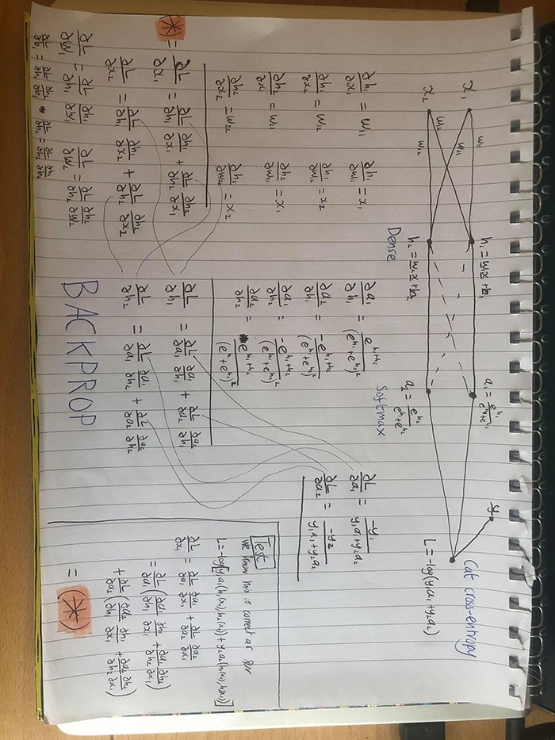

# Deep Learning Framework from Scratch

Build a simple deep learning framework with some challenging constraints.

## MNIST Application

## Constraints

1. No third-party libraries.
2. I cannot look at any implementation related to machine learning.
3. I cannot look into any detailed theory that would help me implement a feature.

For example, I can Google to see what the update rule for Adam is, however, I cannot Google to see how backpropagation works. Instead, learning about backpropagation looks more like the image below. These restrictions obviously mean that this project is a lot of trial and error, however, it's taught me a greal deal about how and why deep learning works.

  

## Features Available 

1. Dense/FC layer
2. Softmax
3. SGD limited to a batch size of 1

## Features Coming Soon

1. 2D CNN Layer
2. ReLU, Sigmoid and tanh
3. AdaGrad, RMSProp and Adam
4. No limit to batch size for optimization

